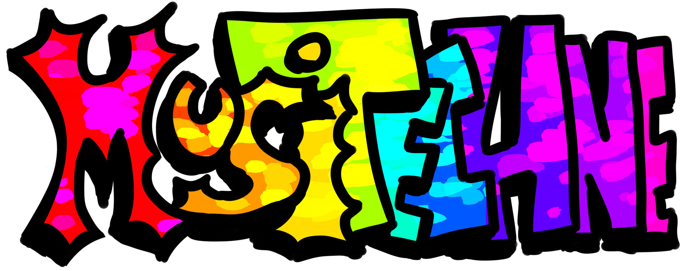
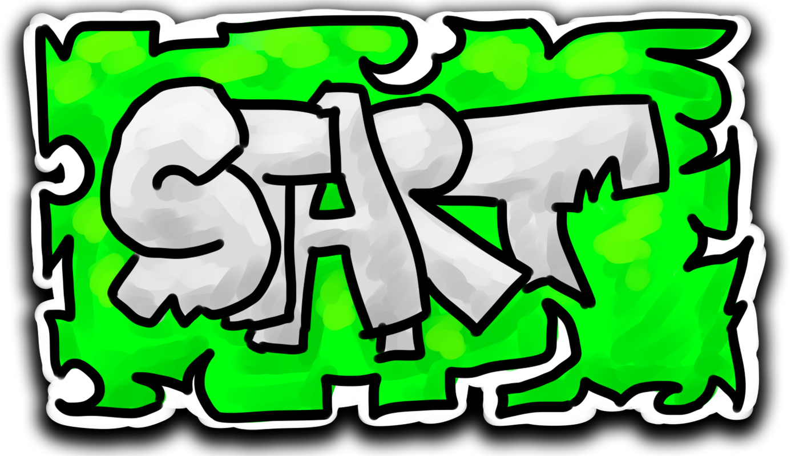

# 🎹 MusiTechne

Музыкальная браузерная игра. Играйте по готовым таймингам или создавайте уникальные треки!

## 👥 Команда
* **Марк/lit0uwu(TeamLead / Full Stack Developer):** Аудио-движок (Tone.js), математика Canvas, архитектура проекта, спрайты маскота, иконки.
* **Михаил/hellm0n (Features / Developer):** Рефакторинг кода, фикс багов, функции.
* **Никита/NikitaHoh (Tester / Quality Control):** Ручное тестирование UI, контроль качества деплоя, тестирование через программирование.
* **Даниил/Kohegar (Features / Developer):** Анимации, фичи.

## 🚀 MVP
* Рабочая страница основная
* Рабочее нажатие на пианино.
* Несколько предустановленных мелодий.
* Редактор мелодий.
* Несколько раскладок в редакторе мелодий.
* Анимация движения тайлов.
* Персонаж маскот из нескольких спрайтов. 

## 🛠 Стек
* HTML / CSS / JavaScript
* Звук: `Tone.js`
* Рендер: `Canvas API`

## 🕹 Начать играть

